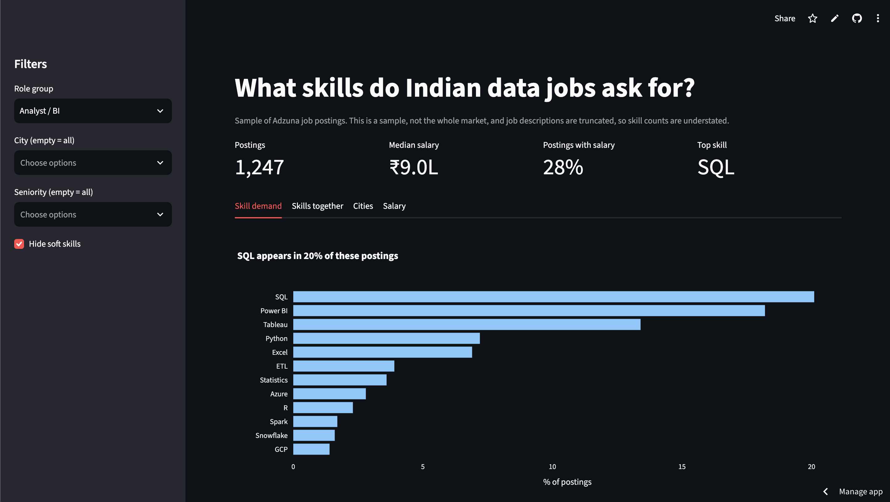

# SkillCompass India

**What skills do Indian data analyst jobs ask for, and which should you learn first?**
An end-to-end analysis of [N] job postings: API data collection, SQL database, skill extraction, analysis, and an interactive dashboard.

**[Live dashboard →](https://skillcompass-india.streamlit.app/)**



## Key findings

> Replace the numbers below with your final results (re-run `analysis.py` after all fixes).

- **SQL appears in [X]% of analyst postings, [X]x as often as Python.** [X]% of postings that ask for Python also ask for SQL.
- **Power BI and Tableau** appear in [X]% and [X]% of postings. [One sentence on what this means, with the sampling caveat below.]
- **The most common skill pair is [SQL + Power BI]**, appearing together in [X] postings.
- **[City] leads with [X] postings**, followed by [City] and [City].
- **Salary:** the median advertised salary is ₹[X]L per year (based on [N] postings that state one). [One sentence on the skill comparison, if you have enough data.]

## Questions I set out to answer

1. Which skills are most in demand for analyst roles?
2. How do salaries differ for postings that mention different skills?
3. Which skills are typically asked for together?
4. How does demand differ across cities?
5. How do analyst requirements differ from data science requirements?

## Data and method

1. **Collection** (`collect.py`): pulled postings from the Adzuna API (India) for search terms such as "data analyst", "business analyst", "sql analyst", and "power bi". Retries with backoff handle API outages.
2. **Storage** (`schema.sql`): SQLite database with three tables: `postings`, `skills`, `posting_skills`.
3. **Skill extraction** (`extract_skills.py`): regex matching for [N] skills across categories (languages, BI tools, databases, cloud, concepts).
4. **Cleaning** (`clean.py`): normalized city names, labeled seniority and role family from job titles, removed implausible salaries, and flagged [N] duplicate postings.
5. **Analysis** (`queries.sql`, `analysis.py`): SQL with joins, CTEs, and window functions for skill demand, co-occurrence, and median salary; pandas and matplotlib for charts.
6. **Dashboard** (`app.py`): Streamlit app with filters for role group, city, and seniority.

**Dataset:** [N] unique postings after removing duplicates, collected [dates]. [N] analyst/BI postings, [N] with a stated salary.

## Limitations

Being upfront about these matters more than hiding them.

- **This is a sample, not the whole market.** Results depend on my search terms and on what Adzuna indexes. Findings like "Power BI vs Tableau" describe this dataset.
- **Descriptions are truncated by the API**, so skill counts are understated, especially skills mentioned late in a posting (e.g., Excel).
- **Skills are found by keyword matching**, which can miss synonyms and occasionally mismatch.
- **Salary is missing for most postings** (about [X]% have one), so salary results are noisy and cover few skills.
- **Skill and salary are confounded.** Skills overlap heavily, so the salary chart shows postings that mention a skill, not what the skill is worth.
- **About [X]% of postings list only "India" or a state** and are excluded from city analysis.

## What went wrong (and what I did about it)

- The API returned 503 errors mid-collection. I added retries with exponential backoff and made inserts idempotent so re-runs never create duplicates.
- My first "Other" city bucket held 30% of the data. Investigating showed most were country-only locations, so I split it into "Unspecified" and "Other" instead of forcing a wrong city.
- [Add your own: anything else that broke or surprised you.]

## Run it yourself

```bash
pip install -r requirements.txt
export ADZUNA_APP_ID=your_id
export ADZUNA_APP_KEY=your_key

python3 collect.py          # fetch postings into jobs.db
python3 extract_skills.py   # tag skills
python3 clean.py            # clean and flag duplicates
python3 analysis.py         # tables and charts in outputs/
python3 export_slim.py      # slim CSVs for the dashboard
streamlit run app.py
```

## Project structure

```
├── collect.py          # API collection
├── extract_skills.py   # skill tagging
├── clean.py            # cleaning and labeling
├── schema.sql          # database schema
├── queries.sql         # the analysis queries
├── analysis.py         # runs analysis, saves charts
├── export_slim.py      # exports dashboard data
├── app.py              # Streamlit dashboard
└── data/               # slim CSVs used by the dashboard
```

## Next steps

- Collect daily to track how skill demand changes over time
- Improve skill extraction with a larger vocabulary or NLP
- Add a second data source to reduce single-API bias

## Tech

Python (pandas, requests, matplotlib, plotly), SQLite, Streamlit.

*Data from Adzuna. Built by Diya*
